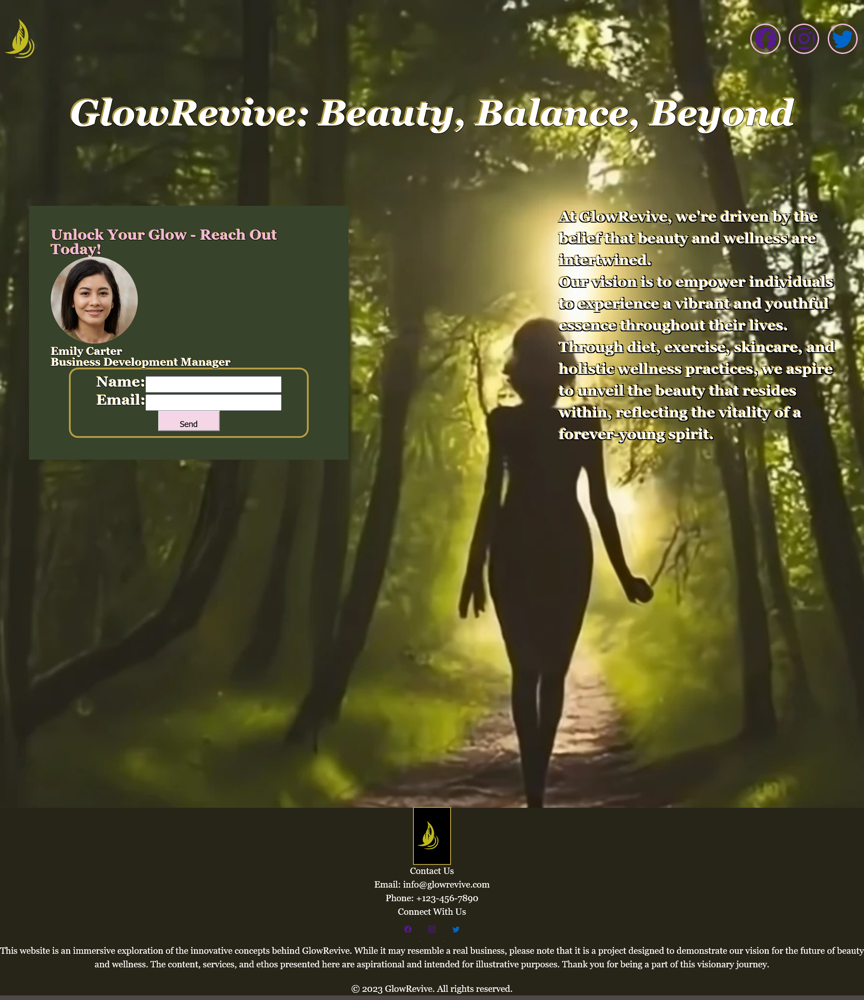

# GlowRevive Contact Data Collection Page

## Description
This project, built only on HTML and CSS serves as a tool for efficiently gathering contact information. The simple process makes it easy for individuals to connect with us and become part of our vibrant community. 
  
Users can submit their names and email addresses which enables us to keep them informed about the latest beauty and wellness trends, exclusive offers, and inspiring content.

Even though this page was built only with HTML and CSS, JavaScript can be implemented in the future to allow the page to be more interactive.

 ## Table of Contents 

  * [Installation](#installation)
  * [Usage](#usage)
  * [Credits](#credits)
  * [License](#license)
  * [Contribute](#contribute)

## [Installation](#table-of-contents)

  this project does not need to be installed.

  ## [Usage](#table-of-contents)

  Navigate to the URL and submit your information

  -  *note: any information sent will not be submitted as the site still requires scripting to make it function*

  [Visit the website !](https://jay-mm.github.io/beautiful-arrival/)

  
  
   ## [Credits](#table-of-contents)
   
  this app uses the folowing technologies:
  - HMTL 
  - CSS 
  - InkSpace
  - [FaceStudio](https://facestudio.app/) 
  - [craiyon](https://www.craiyon.com/) 
  - [bootstrap](https://icons.getbootstrap.com/)

   ## [Contribute](#table-of-contents)
  
  if you would like to contribute to this project or have any pointers  feel free to contact me through:

  - [E-mail](mailto:marquez.jay444@gmail.com)
  - [GitHub.](https://www.github.com/Jay-MM)